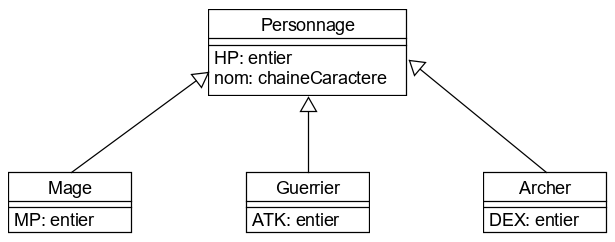
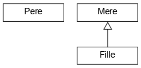
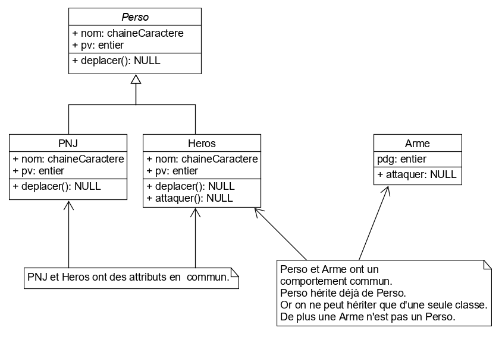
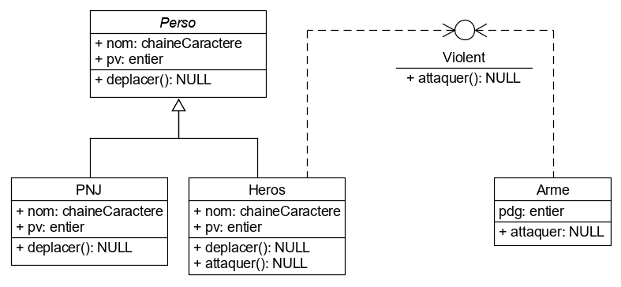
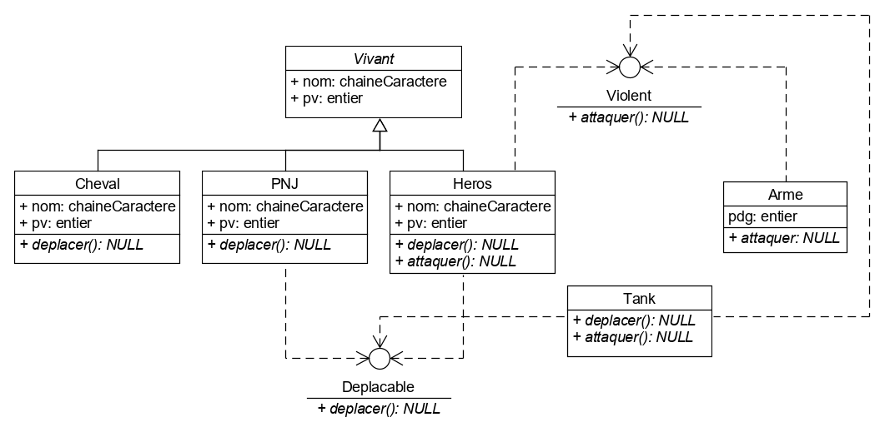
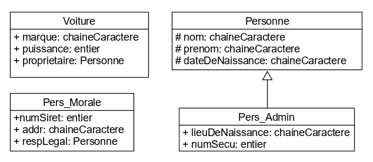

Algo II : Cycle developpement logiciel IFA - Metz
=================================================
Janvier 2020
---
---

## 02/01/2020
---
## Objet

### Déclaration
Classe Toto
	var T: entier
	var Q: reel
	
	Fonction F1(...): NULL
		...
	FinFonction
FinClasse

```
var C1: Toto
```

### Initialisation
```
	C1 = nouveau Toto()
```

### Utilisation
```
	C1.T = 10
	C1.F1(...)
```
	
### Mot-clé this
Référence l'instance en cours.


### Constructeur
Porte obligatoirement le nom de la classe. Renvoi la classe.
```
Fonction Toto(...):Toto
	...
FinFonction
```

### Destructeur
Si elle existe, appelée automatiquement quand l'interpréteur tue l'instance.
```
Fonction ~Toto():NULL
Debut
	// P est un pointeur de structure Point pour l'exemple.
	Si P != NULL Alors
		liberer(P)
	FinSi
FinFonction
```

---
## Exo 1
Ecrire une classe voiture qui comprend les attributs suivants:
- couleur
- marque
-puissance

Et permet de changer les vitesses

### Ma version
```
Classe Voiture
	var couleur: chaineCaractere
	var marque: chaineCaractere
	var puissance: entier
	var rapports: tableau[7] de char
	var idxVitesse: entier
	
	Fonction Voiture(couleur: chaineCaractere, marque: chaineCaractere, puissance: entier): NULL
		this.couleur = couleur
		this.marque = marque
		this.puissance = puissance
		this.vitesse = 0
		this.idxVitesse = 0
		
		rapports[0] = '0' // Point mort
		rapports[1] = '1'
		rapports[2] = '2'
		rapports[3] = '3'
		rapports[4] = '4'
		rapports[5] = '5'
		rapports[6] = 'R' // Marche arrière
	FinFonction
	
	Fonction changerVitesse(vitesse: char): NULL
		this.vitesse = vitesse
	FinFonction
	
	Fonction incrémenterVitesse(): NULL
		Si idxVitesse < 6 Alors
			idxVitesse = idxVitesse + 1
		FinSi
	FinFonction
	
	Fonction decrementerVitesse(): NULL
		Si idxVitesse > 1 Alors
			idxVitesse = idxVitesse - 1
		FinSi
	FinFonction
		
FinClasse
```

### Correction
```
Classe Voiture
	var couleur: chaineCaractere
	var marque: chaineCaractere
	var puissance: entier
	var vitesseMax: entier
	var vitesseActuelle: entier
	
	Fonction Voiture(): Voiture
		this.Voiture("noire", "renault", 100, 6)
	FinFonction
	
	Fonction Voiture(var couleur: chaineCaractere, var marque: chaineCaractere, puissance: entier, var vitesseMax: entier): Voiture
		this.couleur = couleur
		this.marque = marque
		this.puissance = puissance
		this.vitesseMax = vitesseMax
		this.vitesseActuelle = 0
	FinFonction
	
	Fonction vitesseUp(): NULL
		Si this.vitesseActuelle < this.vitesseMax Alors
			this.vitesseActuelle = this.vitesseActuelle + 1
		FinSi
	FinFonction
	
	Fonction vitesseDown(): NULL
		Si vitesseActuelle > 1 Alors
			this.vitesseActuelle = this.vitesseActuelle - 1
		FinSi
	FinFonction
FinClasse
```
---
## Exo 2
Ecrire un programme qui permet à un client d'ajouter plusieurs voitures à un panier.
Afficher la liste des voitures.
Afficher le total.

### Ma version
```
Debut Exo 2
	Classe Voiture
		var couleur: chaineCaractere
		var marque: chaineCaractere
		var puissance: entier
		var vitesseMax: entier
		var vitesseActuelle: entier
		var prix: reel
		
		Fonction Voiture(): Voiture
			this.Voiture("noire", "renault", 100, 6)
		FinFonction
		
		Fonction Voiture(var couleur: chaineCaractere, var marque: chaineCaractere, puissance: entier, var vitesseMax: entier, prix: reel): Voiture
			this.couleur = couleur
			this.marque = marque
			this.puissance = puissance
			this.vitesseMax = vitesseMax
			this.vitesseActuelle = 0
			this.prix = prix
		FinFonction
		
		Fonction vitesseUp(): NULL
			Si this.vitesseActuelle < this.vitesseMax Alors
				this.vitesseActuelle = this.vitesseActuelle + 1
			FinSi
		FinFonction
		
		Fonction vitesseDown(): NULL
			Si vitesseActuelle > 1 Alors
				this.vitesseActuelle = this.vitesseActuelle - 1
			FinSi
		FinFonction
		
		Fonction getPrix(): reel
			retourne this.prix
		FinFonction
		
		Fonction afficherVoiture(): NULL
			afficherChaine(couleur)
			afficherChaine(marque)
			afficherEntier(puissance)
			afficherEntier(vitesseMax)
			afficherEntier(vitesseActuelle)
			afficherReel(prix)
		FinFonction
	FinClasse
	
	Classe Item
		var v: Voiture
		var quantite: entier
		
		Fonction Item(var v: Voiture, var quantite: entier): Item
			this.v = v
			this.quantite = quantite
		FinFonction
		
		Fonction getVoiture(): Voiture
			retourne this.v
		FinFonction
		
		Fonction getQuantite(): entier
			retourne this.quantite
		FinFonction
		
		Fonction setVoiture(var v: Voiture): NULL
			this.v = v
		FinFonction
		
		Fonction setQuantite(var quantite: entier)
			this.quantite = quantite
		FinFonction
	FinClasse
	
	Classe Panier
		var tabItem: tableau[]: Item
		var index: entier
		var taille: entier
		var total: reel
		
		Fonction Panier()
			this.index = 0
			this.taille = 0
			this.total = 0
		FinFonction
		
		Fonction ajouterItem(v: Voiture, quantite: entier): NULL
			var itm: Item
		Debut
			itm = nouveau Item(v, quantite)
			taille = taille + 1
			redim(tabItem, taille)
			tabItem[taille-1] = itm
		FinFonction
		
		Fonction retirerItem(var idx: entier): NULL
			// Vérification si l'index passé est valide
			Si ((idx >= 0) && (idx < taille)) Alors
				Pour i allant de idx à taille par pas de 1 Faire
					tabItem[i] = tabItem[i+1]
					taille = taille - 1
					redim(tabItem, taille)
				FinPour
			FinSi
		FinFonction
		
		Fonction afficherItems(): NULL
			total = 0
			Pour i allant de 0 à taille - 1 par pas de 1 Faire
				tabItem[i].v.afficherVoiture()
				afficherEntier(tabItem[i].quantite)
				total = tabItem[i].v.getPrix()
			FinPour
			afficherReel(total)
		FinFonction
		
	FinClasse
	
	var panier: Panier
	var choix: char
	// Variables liées à l'objet voiture
	var v: Voiture
	var couleur: chaineCaractere
	var marque: chaineCaractere
	puissance: entier
	var vitesseMax: entier
	prix: reel
	// Variables nécessaires à l'objet Item
	var quantite: entier
	// Autre variables
	var idx: entier
Debut
	panier = nouveau Panier()
	
	Faire
		choix = saisirChar()
		
		SelonQue
			Cas 'a' // Ajout d'une voiture au panier
				couleur: saisirChaine()
				marque = saisirChaine()
				puissance = saisirEntier()
				vitesseMax = saisirEntier()
				prix = saisirReel()
				v = nouveau Voiture(couleur, marque, puissance, vitesseMax, prix)
				quantite = saisirReel()
				panier.ajouterItem(v,q)
			FinCas
			Cas 'r' // Retrait d'une voiture au panier
				idx = saisirEntier()
				panier.retirerItem(idx)
			FinCas
			Cas 'd' // Affichage des voitures du panier
				panier.afficherItems()
			FinCas
		FinSelonQue
	TantQue choix != '.'
	FinFaire
Fin
```

## Correction
```
Debut Exo 2
	Classe Voiture
		var couleur: chaineCaractere
		var marque: chaineCaractere
		var puissance: entier
		var vitesseMax: entier
		var vitesseActuelle: entier
		var prix: entier
		
		Fonction Voiture(): Voiture
			this.Voiture("noire", "renault", 100, 6)
		FinFonction
		
		Fonction Voiture(var couleur: chaineCaractere, var marque: chaineCaractere, puissance: entier, var vitesseMax: entier, prix: entier): Voiture
			this.couleur = couleur
			this.marque = marque
			this.puissance = puissance
			this.vitesseMax = vitesseMax
			this.vitesseActuelle = 0
			this.prix = prix
		FinFonction
		
		Fonction vitesseUp(): NULL
			Si this.vitesseActuelle < this.vitesseMax Alors
				this.vitesseActuelle = this.vitesseActuelle + 1
			FinSi
		FinFonction
		
		Fonction vitesseDown(): NULL
			Si vitesseActuelle > 1 Alors
				this.vitesseActuelle = this.vitesseActuelle - 1
			FinSi
		FinFonction
	FinClasse
	
	var panier: tableau[]: Voiture
	var nbPanier: entier
	var inventaire: tableau[3]: Voiture
	var total: entier
	var choix: entier
	
	Fonction creerInventaire(): tableau[]: Voiture
		var inv: tableau[3]: Voiture
	Debut
		Pour i allant de 0 à 2 par pas de 1 Faire
			inv[i] = nouveau Voiture(saisirChaine(), saisirChaine(), saisirEntier(), saisirEntier(), saisirEntier())
		FinPour
		
		Retourne inv
	FinFonction
	
	Fonction afficherVoiture(var v: Voiture): NULL
		afficherChaine(v.marque)
		afficherChaine(v.couleur)
		afficherEntier(v.puissance)
		afficherEntier(vitesseMax)
		afficherEntier(v.prix)
	FinFonction
Debut
	inventaire = creerInventaire()
	
	Faire
		Pour i allant de 0 à 3 par pas de 1 Faire
			afficherEntier(i)
			afficherVoiture(inv[i])
		FinPour
		
		choix = saisir()
		
		Si choix >= 0 && choix <= 2
			nbPanier = nbPanier + 1
			redim(panier, nbPanier)
			panier[nbPanier -1] = nouveau Voiture(inv[choix].couleur, inv[choix].marque, inv[choix].puissance, inv[choix]..vitesseMax, inv[choix].prix)
		FinSi
	TantQue (choix >= 0 && choix < 3)
	FinFaire
	
	Pour i allant de 0 à nbPanier par pas de 1
		afficherVoiture(panier[i])
		total = total + panier[i].prix
	FinPour
	afficherEntier(total)
Fin
```
---
## Exo 3
Ecrire une classe de personnages de jeu. Un personnage à:
- nom
- PV
- ATK
- DEF
Ecrire un programme principal pour créer une équipe de 3 persos max
Afficher l'équipe
Ecrire un maximum de fonctions

### Ma Version
```
Debut Exo 3
	Classe Personnage
		var nom: chaineCaractere
		var pv: entier
		var atk: entier
		var def: entier
		
		Fonction Personnage(nom: chaineCaractere): Personnage
			this.Personnage(nom, 100, 50, 50)
		FinFonction
		
		Fonction Personnage(nom: chaineCaractere, pv: entier, atk: entier, def: entier): Personnage
			this.nom = nom
			this.pv = pv
			this.atk = atk
			this.def = def
		FinFonction
		
		Fonction afficherPersonnage(): NULL
			afficherChaine(this.nom)
			afficherEntier(this.pv)
			afficherEntier(this.atk)
			afficherEntier(this.def)
		FinFonction
	FinClasse
	
	var membresMax: entier
	var equipe: tableau []: Personnage
	var nbMembre: entier
	var choix: char
	

Debut
	membresMax = 3
	nbMembre = 0
	
	Faire
		choix = saisirChar()
		Si choix == 'a' Alors // Add
			nbMembre = nbMembre + 1
			redim(equipe, nbMembre)
			equipe[nbMembre - 1] = nouveau Personnage(saisirChaine(), saisirEntier(),  saisirEntier(),  saisirEntier())
		Sinon Si choix == 'd' Alors
			Pour i allant de 0 à nbMembre - 1 par pas de 1 Faire
				equipe[i].afficherPersonnage()
			FinPour
		FinSi
	TantQue (nbMembre < membresMax && choix != '.')
	FinFaire
	
Fin
```

### Correction
```
Debut Exo 3
	Classe Personnage
		var nom: chaineCaractere
		var pv: entier
		var atk: entier
		var def: entier
		
		Fonction Personnage(var nom: chaineCaractere): Personnage
			this.nom = nom
			this.pv = 10
			this.atk = 20
			this.def = 20
		FinFonction
	FinClasse
	
	var compt: entier
	var sortie: entier
	var choix: chaineCaractere
	var listePerso: tableau[4]: Personnage
	
	Fonction affichage (var liste: tableau[4]: Personnage, compt: entier): NULL
		Pour i de 0 à compt par pas de 1 Faire
			afficherChaine(listePerso[i].nom)
			afficherEntier(listePerso[i].pv)
			afficherEntier(listePerso[i].atk)
			afficherEntier(listePerso[i].def)
		FinPour
	FinFonction

Debut
	sortie = 0
	compt = 0
	
	// Première boucle pour forcer la saisie minimale de deux persos)
	Faire
		listePerso[compt] = nouveau Personnage(saisirChaine())
		compt = compt + 1
	TantQue listePerso [1] == NULL
	FinFaire
	
	// Boucle complémentaire
	Faire
		choix = saisirChaine()
		Si choix == "Sortir" Alors
			affichage(listePerso, compt)
			sortie = 1
		Sinon
			compt = compt + 1
			listePerso[compt] = nouveau Personnage(saisirChaine())
		FinSi
	TantQue sortie == 0 || compt <=3
	FinFaire
Fin
```
---
## Exo 4
Ecrire une classe Rectangle qui comprend des méthodes:
- calculer l'aire
- calculer le périmètre
- ajouter 2 rectangles -> Créer un rectangle englobant les deux (appelant plus celui donné en paramètres)

### Ma version
```
Debut Exo 4
	Classe Rectangle
		var x1: entier
		var y1: entier
		var x2: entier
		var y2: entier
		var largeur: entier
		var hauteur: entier
		
		Fonction abs(valeur: entier): entier
			Si valeur < 0 Alors
				valeur = 0 - valeur
			FinSi
			retourne valeur
		FinFonction
		
		Fonction valMin(v1: entier, v2: entier): entier
			Si v2 < v1 Alors
				retourne v2
			FinSi
			
			retourne v1
		FinFonction
		
		Fonction valMax(v1: entier, v2: entier): entier
			Si v1 > v2 Alors
				retourne v1
			FinSi
			
			retourne v2
		FinFonction
		
		Fonction Rectangle(x1: entier, y1: entier, x2: entier, y2: entier)
			this.x1 = x1
			this.y1 = y1
			this.x2 = x2
			this.y2 = y2
			
			largeur = abs(x2 - x1)
			hauteur = abs(y2 - y1)
		FinFonction
		
		Fonction calculerAire()
			var largeur: entier
			var hauteur: entier
		Debut
			retourne largeur * hauteur
		FinFonction
		
		Fonction calculerPerimetre()
			retourne 2* (largeur + hauteur)
		FinFonction
		
		// J'ai mal compris l'énoncé. Il fallait juste ajouter les largeurs et les hauteurs
		
		Fonction ajouterRectangle(rectangle: Rectangle): Rectangle
			var xMin: entier
			var yMin: entier
			var xMax: entier
			var yMax: entier
		Debut
			// Détermination du xMin
			xMin = valMin(this.x1, this.x2)
			xMin = valMin(xMin, rectangle.x1)
			xMin = valMin(xMin, rectangle.x2)
			
			// Détermination du yMin
			yMin = valMin(this.y1, this.y2)
			yMin = valMin (yMin, rectangle.y1)
			yMin = valMin (yMin, rectangle.y2)
			
			// Détermination du xMax
			xMax = valMax(this.x1, this.x2)
			xMax = valMax(xMax, rectangle.x1)
			xMax = valMax(xMax, rectangle.x2)
			
			// Détermination du yMax
			yMax = valMax(this.y1, this.y2)
			yMax = valMax(yMax, rectangle.y1)
			yMax = valMax(yMax, rectangle.y2)
			
			// Création du nouveau rectangle englobant
			retourne nouveau Rectangle(xMin, yMin, xMax, yMax)
		FinFonction
	FinClasse
Debut
Fin
```

### Correction
```
Debut Exo 4
	Classe Rectangle
		var largeur: reel
		var hauteur: reel
		
		Fonction Rectangle(var largeur: reel, var hauteur: reel): Rectangle
			this.largeur = largeur
			this.hauteur = hauteur
		FinFonction
		
		Fonction getPerimetre(): reel
			retourne 2* (largeur + hauteur)
		FinFonction
		
		Fonction getAire(): reel
			retourne largeur * hauteur
		FinFonction
		
		Fonction add(var rect: Rectangle): NULL
			largeur = largeur + rect.largeur
			hauteur = hauteur + rect.hauteur
		FinFonction
	FinClasse
	
	var choix: char
	var rect: Rectangle
	var rectAjout: Rectangle
Debut
	rect = nouveau Rectangle(saisirReel(), saisirReel())
	Faire
		choix = saisirChar()
		
		SelonQue choix
			Cas 'A'
				afficherReel(rect.largeur)
				afficherReel(rect.hauteur)
			FinCas
			Cas '+'
				rectAjout = nouveau Rectangle(saisirReel(), saisirReel())
				rect.add(rectAjout)
			FinCas
			Cas 'P'
				afficherReel(rect.getPerimetre())
			FinCas
			Cas 'S'
				afficherReel(rect.getAire())
			FinCas
		FinSelonQue
	TantQue choix != 'Q'
	FinFaire
Fin
```

### Correction Vincent
```
Debut Exo 4
	Structure PTS
		var largeur
		var hauteur
	FinStructure
	
	Classe Rectangle
		var largeur: reel
		var hauteur: reel
		var P0: ^PTS
		
		Fonction rectangle(var x: reel, var y: reel, var h: reel, var l: reel): Rectangle
			P0 = malloc(PTS)
			P0^.x = x
			P0^.y = y
			hauteur = h
			largeur = l
		FinFonction
		
		Fonction Rectangle(): Rectangle
			this.Rectangle(0,0,1,1)
		FinFonction
		
		Fonction ~Rectangle(): NULL
			liberer(P0)
		FinFonction
	FinClasse
	
	var toto: Rectangle
Debut
	toto = nouveau Rectangle
	// Reste de l'implémentation
Fin
```
## 06/01/2020
## Encapsulation
Les variables, fonctions et classes ont une accessibilité variable. Elles peuvent être soit privées, publiques ou restreintes.
Pour préciser ces accès ont introduit respectivement les mots-clé private, public et protected.

private → Inaccessible depuis l'extérieur de la classe
public → Accessible depuis l'extérieur de la classe
protected → Public pour les classes enfant. Privé pour les autres.

On accède à un attribut privé ou on le modifie avec des assesseurs (getter) et des modificateurs (setter). D'où le nom d'encapsulation (utilisation de méthodes intermédiaires).
	


```	
Classe Personnage
	private var hp: entier
	public var nom: chaineCaractere
	public Fonction Personnage(var hp: entier, var nom: chaineCaractere): Personnage
		this.hp = hp
		this.nom = nom
	FinFonction
	
	public Fonction Personnage(): Personnage
		this.Personnage(100, "Perso")
	FinFonction
	
	public Fonction getHp(): entier
		retourne hp
	FinFonction
FinClasse

Classe Mage herite Personnage
	public var mp: entier
	public Fonction Mage(var nom: chaineCaractere): Mage
		base(20,nom)
	FinFonction
	...
FinClasse

var p: Personnage
var m: Mage
Debut
	p = nouveau Personnage()
	m = nouveau Mage("toto")
	afficherEntier(p.getHp())
	afficherChaine(p.nom)
	afficherEntier(mp)
	afficherChaine(m.nom)
Fin
```
```
Classe Guerrier herite Personnage
	private var atk: entier
	
	public Fonction Guerrier(var nom: chaineCaractere): Guerrier
		this.Guerrier(nom, 1000, 92)
	FinFonction
	
	public Fonction Guerrier(var nom: chaineCaractere, var hp: entier, var atk: entier): Guerrier
		base(hp, nom)
		setAtk(atk)
	FinFonction
	
	public Fonction getAtk(): entier
		retourne this.atk
	FinFonction
	
	public Fonction setAtk(var atk: entier): NULL
		this.atk = atk
	FinFonction
FinClasse
```
---
## Exo 5
Ecrire une classe qui représente un compte bancaire.
	Comprend une méthode qui permet d'ajouter des intérets.
Ecrire un programme qui
- affiche le solde.
- procède au versement + intérets
- procède au retrait + intérets
N'autorise pas à être débiteur.

### Ma version
```
Debut Exo 5
	Classe CompteBancaire
		private var solde: reel
		private interet: reel // En pourcentage. ex: 2 pour 2%
		
		public Fonction CompteBancaire(var solde: reel, var interet: reel): CompteBancaire
			this.solde = solde
			this.interet = interet
		FinFonction
		
		public Fonction getSolde(): reel
			retourne this.solde
		FinFonction
		
		public Fonction setSolde(var solde: entier): NULL
			this.solde = solde
		FinFonction
		
		private Fonction getInterets(): reel
			var taux: reel
		Debut
			taux = interet /100
			retourne solde * taux
		FinFonction
		
		public Fonction depot(var somme: reel): NULL
			solde = solde + somme + getInterets()
		FinFonction
		
		public Fonction retrait(var somme: reel): NULL
			Si somme > solde Alors
				solde = 0 // On permet le retrait à hauteur du solde.
			Sinon
				solde = solde - somme + getInterets()
		FinFonction
	FinClasse
	
	public var choix: char
	public var cb: CompteBancaire
Debut
	cb = nouveau CompteBancaire(1000, 0.25)
	
	Faire
		choix = saisirChar()
		SelonQue choix
			Cas 'a' // Affichage
				afficherReel(cb.getSolde())
			FinCas
			Cas  'd' // Dépôt
				cb.depot(saisirReel())
			FinCas
			Cas 'r' // Retrait
				cb.retrait(saisirReel())
			FinCas
		FinSelonQue
	TantQue choix = '.'
	FinFaire
Fin
```
---
## Exo 6
Un service hospitalier gère les fiches de ses patients. Il contiennent:
- Nom
- Prénom
- Date de naissance (chaine de caractères)
Si le patient est mineur, il y a ajout d'un nom et prénom de tuteur légal
Si le patient est une femme, on ajoute un nom de jeune fille.

### Ma version
```
Debut Exo 6
	Classe Personne
		private var nom: chaineCaractere
		private var prenom: chaineCaractere
		private var dateNaissance: chaineCaractere
		
		public Fonction Personne(var nom: chaineCaractere, var prenom: chaineCaractere): Personne
			setNom(nom)
			setPrenom(prenom)
		FinFonction
		
		public Fonction Personne(var nom: chaineCaractere, var prenom: chaineCaractere, var dateNaissance: chaineCaractere): Personne
			this.Personne(nom, prenom)
			setDateNaissance(dateNaissance)
		FinFonction
		
		public Fonction getNom():chaineCaractere
			retourne this.nom
		FinFonction
		public Fonction getPrenom():chaineCaractere
			this.prenom
		FinFonction
		
		public Fonction getDateNaissance():chaineCaractere
			retourne this.dateNaissance
		FinFonction
		
		public Fonction setNom(var nom: chaineCaractere): NULL
			this.nom = nom
		FinFonction
		public Fonction setPrenom(var prenom: chaineCaractere): NULL
			this.prenom = prenom
		FinFonction
		
		public Fonction setDateNaissance(var dateNaissance: chaineCaractere): NULL
			this.dateNaissance = dateNaissance
		FinFonction
	FinClasse
	
	Classe Femme herite Personne
		private var nomJF: chaineCaractere
		
		public Fonction Femme(var nom: chaineCaractere, var prenom: chaineCaractere, var dateNaissance: chaineCaractere, var nomJF: chaineCaractere): Femme
			base(nom, prenom, dateNaissance)
			setNJF(nomJF)
		FinFonction
		
		public Fonction getNJF(): chaineCaractere
			retourne this.nomJF
		FinFonction
		
		public Fonction setNJF(var nomJF: chaineCaractere): NULL
			this.nomJF = nomJF
		FinFonction
	FinClasse
	
	Classe Mineur herite Personne
		private var tuteur: Personne
		
		public Fonction Mineur(var nom: chaineCaractere, var prenom: chaineCaractere, var dateNaissance: chaineCaractere, var tuteur: Personne): Mineur
			base(nom, prenom)
			setTuteur(tuteur)
		FinFonction
		
		public Fonction getTuteur(): Personne
			retourne this.tuteur
		FinFonction
		
		public Fonction setTuteur(var tuteur: Personne): NULL
			this.tuteur = tuteur
		FinFonction
	FinClasse
Debut
Fin
```
---
## 08/01/2020
---
## Surcharge d'opérateurs et de méthodes

## Surcharge d'opérateurs

Permet d'appliquer des opérateurs (`+`, `-`, `*`, `/`) ou méthodes (`afficher()`) particulières à notre classe.

`public toString(): chaineCaractere` Permet `afficher(A)`

`public add(var op: Type): Type` Permet `A + B`

`public supp(var op: Type): Type`Permet `A - B`

`public mult(var op: Type): Type`Permet `A * B`

`public div(var op: Type): Type` Permet `A / B`

`public clone(var op: Type): Type` Clone dans une nouvelle instance de classe.

`public equal(var op: Type): Boolean` Permet de tester si A == B

---
## Exo 7
Faire une calculatrice.

### Ma version
```
Debut Exo 7
	Classe Calculatrice
		private var resultat: reel
		
		public Fonction Calculatrice(): Calculatrice
			resultat = 0
		FinFonction
		
		public Fonction add(var operande: reel): reel
			retourne resultat + operande
		FinFonction
		
		public Fonction sub(var operande: reel): reel
			retourne resultat - operande
		FinFonction
		
		public Fonction mult(var operande: reel): reel
			retourne resultat * operande
		FinFonction
		
		public Fonction div(var operande: reel): reel
			Si operande != 0 Alors
				retourne resultat / operande
			FinSi
			
			afficherChaine("Division par 0 impossible. Opération non réalisée.")
			retourne resultat
		FinFonction
		
		public Fonction truc(var): NULL
		
		FinFonction
	FinClasse
	
	var choix: char
	var operande: reel
	var calc: Calculatrice
Debut
	calc = nouveau Calculatrice()
	
	Faire
		choix = saisieChar()
		operande = saisirReel()
		
		SelonQue choix
			Cas 'a'
				resultat = calc.add(operande)
			FinCas
			Cas 's'
				resultat = calc.sub(operande)
			FinCas
			Cas 'm'
				resultat = calc.mult(operande)
			FinCas
			Cas 'd'
				resultat = calc.div(operande)
			FinCas
		FinSelonQue
	TantQue choix != 'q'
	FinFaire
Fin
```

### Correction
```
Classe Nombre
	private var n: entier
	
	public Fonction Nombre(var n: entier): Nombre
		this.n = n
	FinFonction
	
	public Fonction add(var op: Nombre): Nombre
		retourne nouveau op(this.n + op.n)
	FinFonction
	public Fonction supp(var op: Nombre): Nombre
		retourne nouveau op(this.n - op.n)
	FinFonction
	public Fonction mult(var op: Nombre): Nombre
		retourne nouveau op(this.n * op.n)
	FinFonction
	public Fonction div(var op: Nombre): Nombre
		Si op.n != 0 Alors
			retourne nouveau op(this.n - op.n)
		FinSi
		
		retourne NULL
	FinFonction
	
	public Fonction toString(): chaineCaractere
		retourne this.n.toString() // ou ""+N ← Cast implicite de int vers String
	FinFonction
FinClasse
```
---
## Exo 8
Ecrire une classe Vecteur2D définie par 2 valeurs x et y qui permet de faire des opérations sur vecteurs en entier ou réel.
Afficher "Vecteur 2D x:... y:..."

### Ma version
```
Classe Vecteur2D
	public x: reel
	public y:reel
	
	public Fonction add(var op: Vecteur2D): Vecteur2D
		var vect: Vecteur2D
	Debut
		this.x = this.x + op.x
		this.y = this.y + op.x
	FinFonction
	
	public Fonction supp(var op: Vecteur2D): Vecteur2D
		var vect: Vecteur2D
	Debut
		this.x = this.x - op.x
		this.y = this.y - op.y
	FinFonction
	
	public Fonction mult(var op: Vecteur2D): Vecteur2D
		var vect: Vecteur2D
	Debut
		this.x = this.x * op.x
		this.y = this.y * op.y
	FinFonction
	
	public Fonction div(var op: Vecteur2D): Vecteur2D
		var vect: Vecteur2D
	Debut
		this.x = this.x / op.x
		this.y = this.y / op.y
	FinFonction
	
	public Fonction clone(var op: Vecteur2D): Vecteur2D
		var vect: Vecteur2D
	Debut
		op.x = this.x
		op.y = this.y
	FinFonction
	
	public Fonction equal(var op: Vecteur2D): Booleen
		Si (op.x == this.x) && (op.y == this.y) Alors
			retourne VRAI
		FinSi
		retourne FAUX
	FinFonction
	
	public Fonction toString(): chaineCaractere
		afficherChaine("Vecteur2D x:"+this.x+" y:"+this.y)
	FinFonction
FinClasse
```

### Correction
```
Classe Vecteur2D
	private var x: reel
	private var y: reel
	
	public Vecteur2D()
		this.Vecteur2D(0,0)
	FinFonction
	
	public Vecteur2D(var x: reel, var y: reel): Vecteur2D
		setX(x)
		setY(y)
	FinFonction
	
	public Vecteur2D(var x: entier, var y: entier): Vecteur2D
		setX(x)
		setY(y)
	FinFonction
	
	public Fonction getX(): reel
		retourne x
	FinFonction
	
	public Fonction getY(): reel
		retourne y
	FinFonction
	
	public setX(var x: reel): NULL
		this.x = x
	FinFonction
	
	public setX(var x: entier): NULL
		this.x = x
	FinFonction	
	
	public setY(var y: reel): NULL
		this.y = y
	FinFonction
	
	public setY(var y: entier): NULL
		this.y = y
	FinFonction		
FinClasse
```
---
## 10/01/2020
---
## Transtypage

```
var v1: Type1
var v2: Type2
	
v1 = (Type1)v2
```
---
## Héritage



```
Debut
	var p: Pere
	var m: Mere
	var f: Fille

	Classe Pere
		public att4: chaineCaractere
	FinClasse

	Classe Mere
		public var att1: entier
		public var att2: reel
	FinClasse

	Classe Fille herite Mere
		public att3: char
	FinClasse

	var t: tableau[10]: Mere
	var c: char
Debut // Code  incohérent n'ayant pour but que de montrer les possibilités du langage.
	p = nouveau Pere()
	m = nouveau Mere()
	m = nouveau Fille() // OK
	f = nouveau Fille()

	m = f // OK → M = (Mere)Fille
	f = m // NOK
	m = p // NOK
	
	// On peut mettre des éléments Fille dans des éléments Mère
	Pour i allant de 0 à 9 par pas de 1 Faire
		c = saisirChar()
		
		Si c == "M" Alors
			t[i] = nouveau Mere()
		Sinon
			t[i] = nouveau Fille()
		FinSi
		
		total = total + t[i].att1
	FinPour
	
	t[4] = nouveau Fille()
	// t à des éléments de type Mere.
	// t[4] est de type Fille.
	// Il faut pourtant caster en Fille pour mettre t[4] dans une variable de type Fille
	f = (Fille)t[4]
Fin
```
---
## Exo 9
Un concessionaire vend des voitures, des bateaux et des camions.
Ils ont pour attributs communs:
- Leur marque
- Leur couleur
- Leur prix

Ils sont distingués par:
- Les voitures → nombres de routes.
- Les camions → poids de leur remorque.
- Les bateaux → nombre de voiles.

```
Debut Exo 9
	Classe Vehicule
		private var marque: chaineCaractere
		private var couleur: chaineCaractere
		private var prix: reel
		
		public Fonction Vehicule(var marque: chaineCaractere, var couleur: chaineCaractere, var prix: reel): Vehicule
			this.marque = marque
			this.couleur = couleur
			this.prix = prix
		FinFonction
		
		public Fonction toString()
			afficherChaine("marque: "+marque+", couleur: "+couleur+", prix: "+prix)
		FinFonction
		
		public Fonction getMarque(): chaineCaractere
			retourne marque
		FinFonction
		
		public Fonction getCouleur(): chaineCaractere
			retourne couleur
		FinFonction
		
		public Fonction getPrix(): reel
			retourne prix
		FinFonction
	FinClasse

	Classe Voiture herite Vehicule
		private var nbRoues: entier
		
		public Fonction Voiture(var marque: chaineCaractere, var couleur: chaineCaractere, var prix: reel, nbRoues: entier): Voiture
			base(marque, couleur, prix)
			this.nbRoues = nbRoues
		FinFonction
		
		public Fonction getNbRoues(): entier
			retourne nbRoues
		FinFonction
		
		public Fonction toString(): chaineCaractere
			afficherChaine("Voiture > "+base.toString()+", nbRoues: "+nbRoues)
		FinFonction
	FinClasse

	Classe Camion herite Vehicule
		private var poidsRemorque: reel
		
		public Fonction Camion(var marque: chaineCaractere, var couleur: chaineCaractere, var prix: reel, var poidsRemorque: reel): Camion
			base(marque, couleur, prix)
			this.poidsRemorque = poidsRemorque
		FinFonction
		
		public Fonction getPoidsRemorque(): reel
			retourne poidsRemorque
		FinFonction
		
		public Fonction toString(): chaineCaractere
			afficherChaine("Camion > "+base.toString()+", poidsRemorque: "+poidsRemorque)
		FinFonction
	FinClasse

	Classe Bateau herite Vehicule
		private var nbVoiles: entier
		
		public Fonction Bateau(var marque: chaineCaractere, var couleur: chaineCaractere, var prix: reel, nbVoiles: entier): Bateau
			base(marque, couleur, prix)
			this.nbVoiles = nbVoiles
		FinFonction
		
		public Fonction getNbVoiles(): entier
			retourne nbVoiles
		FinFonction
		public Fonction toString(): chaineCaractere
			afficherChaine("Bateau > "+base.toString()+", nbVoiles: "+nbVoiles)
		FinFonction
	FinClasse
	
	public var choix: char
	public var taille: entier
	public var total: reel
	public t: tableau[]: Vehicule
Debut
	taille = 0
	total = 0
	
	Faire
		choix = saisieChar()
		
		taille = taille + 1
		
		SelonQue choix
			Cas 'v'
				t[i] = nouveau Voiture(saisirChaine(), saisirChaine(), saisirReel(), saisirEntier())
			FinCas
			Cas 'c'
				t[i] = nouveau Camion(saisirChaine(), saisirChaine(), saisirReel(), saisirReel())
			FinCas
			Cas 'b'
				t[i] = nouveau Bateau(saisirChaine(), saisirChaine(), saisirReel(), saisirEntier())
			FinCas
		FinSelonQue
		
		total = total + t[i].getPrix()
	TantQue choix != 'q'
	FinFaire
	
	afficherEntier(total)
Fin
```
---
## 14/01/2020
---
## Classes Abstraites



Une classe abstraite peut avoir des méthode classiques.
Une méthode abstraite implique une classe abstraite.
```
abstraite Classe Perso
	public nom: chaineCaractere
	public pv: entier
	
	public Fonction Perso() // Même si elle n'est pas instanciable, il faut un constructeur à une classe abstraite.
	FinFonction
	
	public abstraite Fonction deplacer(): NULL // Corps de fonction vide
	FinFonction
FinClasse

Classe PNJ herite Perso
	public Fonction deplacer(): NULL // Fonction redéfinie sans mot-clé abstraite
		afficherChaine("Avancer d'une case")
	FinFonction
FinClasse

var p: Perso // OK
p = nouveau Perso() // NOK
p = nouveau PNJ() // OK
```
## Interfaces

```
Debut
	// Implémente les autres classes vues plus haut.
	...

	Interface Violent
		public abstraite Fonction attaquer(): NULL
		FinFonction
	FinInterface

	Classe Arme implemente Violent
		public var pdg: entier
		...
		
		public Fonction attaquer(): NULL
			afficherChaine("Retire 150 PV.")
		FinFonction
	FinClasse

	Classe Heros herite Perso implemente Violent
		public Fonction Heros(var nom: chaineCaractere, var pv: entier): Heros
			base(nom, pv)
		FinFonction
		
		private deplacerFille(): NULL
			afficherChaine("Saut")
		FinFonction

		public Fonction attaquer(): NULL
			afficherChaine("Retire 10 PV.")
		FinFonction	
	FinClasse

	var degats: tableau[10]: Violent

Debut
	Pour i allant de 0 à 9 par pas de 1 Faire
		degats[i].attaquer()
	FinPour
Fin
```

---
## Exo 10


Une voiture et une entreprise polluent. De ce fait, elles subissent une taxe mensuelle.
Écrire un programme qui simule 1 an de taxation sur 3 entreprises et 4 voitures.

```
Debut Exo 10
	abstraite Classe Personne
		public var nom: chaineCaractere
		public var prenom: chaineCaractere
		public var dateDeNaissance: chaineCaractere
		public var adresse: chaineCaractere
		
		public Fonction Personne(var nom: chaineCaractere, var prenom: chaineCaractere, var dateDeNaissance: chaineCaractere, var adresse: chaineCaractere): Personne
			this.nom = nom
			this.prenom = prenom
			this.dateDeNaissance = dateDeNaissance
			this.adresse = adresse;
		FinFonction
		
		public Fonction Personne(): Personne
			Personne("Fleck", "Arthur", "1 janvier 1970", "Gotham City")
		FinFonction
		
		public Fonction toString(): chaineCaractere
			retourne "nom: "+nom+", prenom: "+prenom+", DdN: "+dateDeNaissance+", Adr: "+ adresse
		FinFonction
	FinClasse
```
---

```
	Classe PersAdmin herite Personne
		public var numSecu: chaineCaractere
		
		public PersAdmin(var nom: chaineCaractere, var prenom: chaineCaractere, var dateDeNaissance: chaineCaractere, var lieuDeNaissance: chaineCaractere, var numSecu: chaineCaractere): PersAdmin
			base(nom, prenom, dateDeNaissance, lieuDeNaissance)
			this.numSecu = numSecu
		FinFonction
		
		public Fonction getLieuDeNaissance(): chaineCaractere
			retourne adresse
		FinFonction
		
		public Fonction setLieuDeNaissance(var lieuDeNaissance: chaineCaractere): NULL
			adresse = lieuDeNaissance
		FinFonction
	FinClasse
```
---
```
	Classe PersMorale herite Personne implemente IPolluant
		private var numSiret: chaineCaractere
		private var respLegal: PersAdmin
		private var coeffPollution: entier
		
		public Fonction PersMorale( var numSiret: chaineCaractere, var respLegal: PersAdmin, var coeffPollution: entier, var nom: chaineCaractere, var prenom: chaineCaractere, var dateCreation: chaineCaractere, var lieuCreation: chaineCaractere): PersMorale
			base(nom, prenom, dateCreation, lieuCreation)
			this.numSiret = numSiret
			this.respLegal = respLegal
			this.coeffPollution = coeffPollution
		FinFonction
		
		public Fonction calculPollution(var nbJours: entier): reel
			retourne coeffPollution * nbJours + 5
		FinFonction
		
		public Fonction payerPollution(var quantitePollution: reel, var tauxPollution: reel): reel
			var taxe: reel
		Debut
			taxe = quantitePollution*tauxPollution
			afficherChaine(respLegal + "payes "+ taxe)
			retourne taxe
		FinFonction
	FinClasse
```
---
```
	Classe Voiture implemente IPolluant
		public var marque: chaineCaractere
		public var proprio: PersAdmin
		public var puissance: entier
		
		public Fonction Voiture(var marque: chaineCaractere, var proprio: PersAdmin, var puissance: entier): Voiture
			this.marque = marque
			this.proprio = proprio
			this.puissance = puissance
		FinFonction
		
		public Fonction calculPollution(var nbJours: entier): reel
			retourne puissance * nbJours * 0.3
		FinFonction
		
		public Fonction payerPollution(var quantitePollution, var tauxPollution): reel
			var taxe: reel
		Debut
			taxe = quantitePollution * tauxPollution
			afficherChaine(proprio + " payes " + taxe)
			retourne taxe
		FinFonction
	FinClasse
```
---
```
	Interface IPolluant
		abstraite Fonction calculPollution():reel
		abstraite Fonction payerPollution(var quantitePollution: reel, var tauxPollution: reel): reel
	FinInterface
```
---
```	
	var taille: entier
	var tab: tableau[]: de IPolluant
	var choix: char
	
	Fonction creerPersonneAdmin():PersAdmin
		retourne nouveau PersAdmin(saisirChaine(), saisirChaine(), saisirChaine(), saisirChaine(), saisirChaine())
	FinFonction
	
	Fonction creerEntreprise():Entreprise
		retourne nouveau PersMorale(saisirChaine(), creerPersonneAdmin(), saisirEntier(), saisirChaine(), saisirChaine(), saisirChaine(), saisirChaine())
	FinFonction
	
	Fonction creerVoiture():Voiture
		retourne nouveau Voiture(saisirChaine(), creerPersonneAdmin(), saisirEntier())
	FinFonction
	
	Fonction modifTab(ref taille: entier, ref tab: tableau[]: IPolluant, var polluant: IPolluant): NULL
		Si polluant != NULL Alors
			taille = taille + 1
			redim(tab, taille)
			tab[taille-1] = polluant
		FinSi
	FinFonction
	
	Fonction simulation(var tab: tableau[]: IPolluant, var taille: entier, var taxe: reel): NULL
		Pour i allant de 0 à 11 par pas de 1 Faire
			Pour j alland de 0 à taille-1 par pas de 1 Faire
				tab[j].payerPollution(tab[j].calculPollution(30,taxe))
			FinPour
		FinPour
	FinFonction
```
---
```
Debut
	taille = 0
	
	Faire
		choix = saisieChar()
		
		SelonQue choix
			Cas 'v'
				modifTab(taille, tab, creerVoiture())
			FinCas
			Cas 'e'
				modifTab(taille, tab, creerEntreprise())
			FinCas
			Cas 's'
				simulation(tab, taille, taxe)
			FinCas
		FinSelonQue
	TantQue (choix != 'q')
	FinFaire
Fin
```